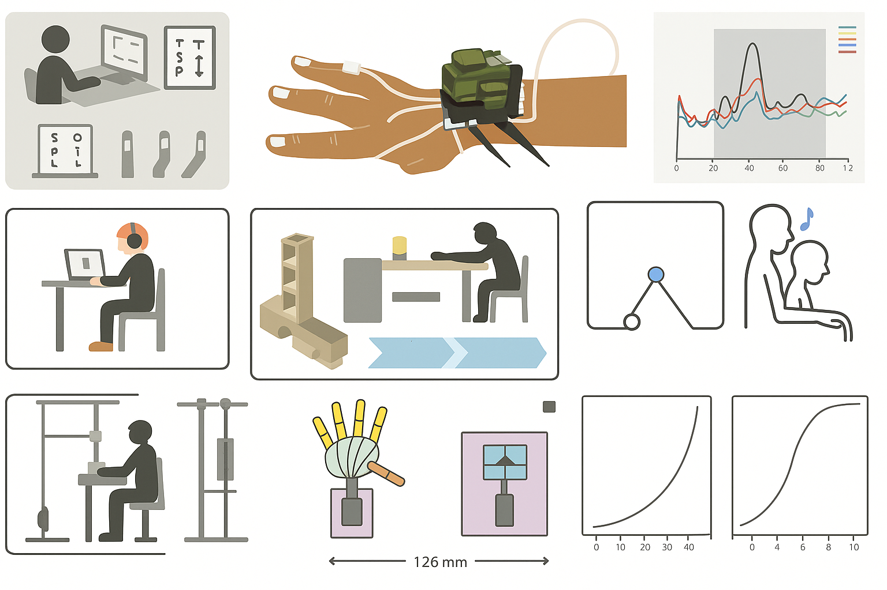

<h2 style="color: #052049;"> Welcome to the BRAIN Lab at IIT Madras!  </h2> 
{: .display-4}

 

<h3 style="color:rgb(123, 13, 21);">What do we do at the BRAIN Lab?</h3>

 
 At the Biomechanics, Rehabilitation, AI and Innovation in Neuroscience (BRAIN) lab, we are interested in understanding mechanics, the neural basis ("control") of skilled human movements. Further we are interested in understanding movement control strategies in people with motor disorders and their rehabilitation. We use AI extensively in our analysis and research. Our overarching goal is to provide innovative solutions to benefit research and therapy in Neuroscience. BRAIN lab is part of the Biomedical Engineering group in the Dept. of Applied Mechanics and Biomedical Engineering at IIT Madras.
 {: .welcomefont}

Note: We were previously called Neuromechanics lab and some of our student feedback use that name. 
{: .welcomefont}

{:style="max-width: 100%; height: auto;"}

 Our current research focuses on studying human movements from the perspective of Biomechanics and Neural control. In addition, we focus on helping people with compromised movement systems (Peripheral neural problems, central neuromotor disorders). In many of our experiments, we use the hand and finger system as the model system.
{: .welcomefont}

This research is inherently interdisciplinary and combines knowledge and questions from Biomechanics, Rehabilitation, AI (and ML), Movement Neuroscience and Robotics/Instrumentation. 
{: .welcomefont}
