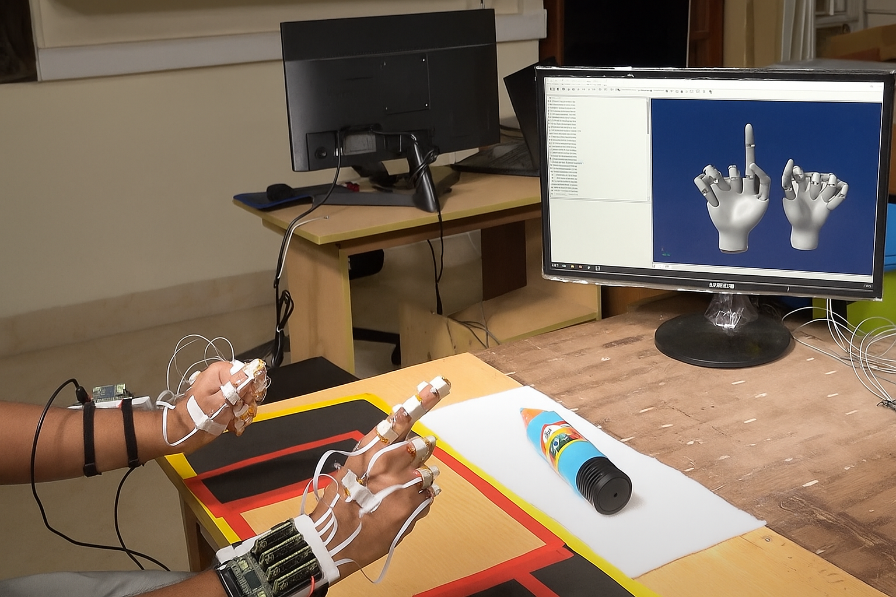

# Our Research

  

At the BRAIN Lab at IITM, we welcome motivated students with open minds and strong work ethics. Our team members support each other professionally and personally, creating an environment where everyone can thrive and contribute.

The idea is to put a group of good kindhearted individuals together in a harassment-free environment that nurtures free thinking and hope that they will shine and become “their best versions”. Everyone is creative; all students have some form of intelligence.

We believe PhD students develop into independent researchers when they take ownership of their work from day one. While high-quality feedback and guidance is always available, we encourage students to drive their own research questions and approaches, with the advisor serving as a mentor and collaborator rather than a director. This means students have near-infinite freedom.

  We strongly believe that students who are responsible thrive with freedom and truly deserve that freedom.

Our lab culture encourages honest, constructive feedback between all members—including the PI. We believe that rigorous peer review within the lab leads to stronger science and better publications. Everyone's perspective is valued, regardless of their position in the academic hierarchy.

(Example: <a href="https://www.sciencedirect.com/science/article/abs/pii/S0028393224002112" target="_blank">Swarnab’s unique paper</a> in the niche journal <i>Neuropsychologia</i>. The presentation of results in this manuscript significantly improved after a particularly polemical lab meeting.)

#### Some Numbers (for reference)

<table style="width:100%; border-collapse: collapse; font-size: 0.95rem;">
  <thead style="background-color:#f8f8f8;">
    <tr>
      <th style="border: 1px solid #ddd; padding: 8px;">Item</th>
      <th style="border: 1px solid #ddd; padding: 8px;">Metric</th>
    </tr>
  </thead>
  <tbody>
    <tr>
      <td style="border: 1px solid #ddd; padding: 8px;">
        <a href="publication.html">Publications (+Patents)</a> in the last 5 years
      </td>
      <td style="border: 1px solid #ddd; padding: 8px;">26 + 2 (Mostly Q1 & Q2 journals)</td>
    </tr>
    <tr>
      <td style="border: 1px solid #ddd; padding: 8px;">Publications currently under consideration</td>
      <td style="border: 1px solid #ddd; padding: 8px;">6</td>
    </tr>
    <tr>
      <td colspan="2" style="border: 1px solid #ddd; padding: 8px; background: #fcfcfc;"><b>Student achievements that we are proud of:</b> We are proud of all our students and all their achievements no matter how small, but here are some metrics just so others can see them:</td>
    </tr>
    <tr>
      <td style="border: 1px solid #ddd; padding: 8px;">Students who received Best PhD thesis award</td>
      <td style="border: 1px solid #ddd; padding: 8px;">1</td>
    </tr>
    <tr>
      <td style="border: 1px solid #ddd; padding: 8px;">Students who went on International exchange</td>
      <td style="border: 1px solid #ddd; padding: 8px;">1</td>
    </tr>
    <tr>
      <td style="border: 1px solid #ddd; padding: 8px;">Students who won Prime Ministers' Research Fellowship (PMRF)</td>
      <td style="border: 1px solid #ddd; padding: 8px;">3</td>
    </tr>
  </tbody>
</table>

  We prioritize publication quality over quantity, focusing on thorough and rigorous studies that advance the broad fields of Biomechanics, Rehabilitation and Movement Neuroscience.

Our track record includes publications in high-quality journals, spread over several disciplines (see publications). We believe in quietly pushing the boundaries by focusing fully on what we do well: rigorous, no-nonsense, old school, experimental neuroscience.

We train ourselves in topics we are not well-versed with. We add value to ourselves in multiple dimensions in this thriving environment while making sure we remain grounded.

#### Current Research Projects

Our research at the BRAIN Lab explores the fascinating intersection of motor control in health, disease, and aging, while also developing innovative rehabilitation diagnostic and therapeutic devices for specific neuromotor disorders.

While we encourage students to bring their own research questions that we can contribute to, we currently have exciting opportunities in:

<ul style="font-size:1.05rem; padding-left: 1.2rem;">
  <li><b>Assistive Devices for Brachial Plexus Injuries:</b> Is Brachial Plexus Injury the Cinderella of upper limb disorders? In this complex pathophysiology, individuals can have devastating sensory and motor deficits. Our objective is to build assistive devices to help improve the quality of life for these patients.</li>
  <li><b>Rehabilitation Technology:</b> Developing diagnostic and therapeutic devices for individuals with Parkinson's disease, specifically a closed-loop therapeutic device. These projects combine engineering innovation with clinical needs to improve patient quality of life and independence.</li>
</ul>

Our approach leverages our extensive experience in human experimentation—including precise fingertip force measurements, sophisticated kinematic analysis, and EEG recording—to understand both the mechanical and neural aspects of movement. (See <a href="facilities.html">facilities</a>)

#### Schedule Expectations & Work-Life Balance

<ul style="font-size:1.05rem; padding-left: 1.2rem;">
  <li>While we don't maintain rigid work schedules, students typically spend time in the lab during daytime hours to maximize collaborative opportunities with both the advisor and fellow lab members.</li>
  <li>We maintain night-time lab curfew hours from <b>9:00 PM to 7:00 AM</b> to promote healthy sleep habits—recognizing that rest, refreshment, and recharging are essential for creative scientific thinking and productive experiments.</li>
  <li>Students manage their own schedules and are encouraged to maintain work-life balance, including engaging in activities outside the lab that bring them joy and perspective. Successful PhD students naturally prioritize research among their top professional commitments.</li>
</ul>

#### Publication Expectations (Minimum)

<ul style="font-size:1.05rem; padding-left: 1.2rem;">
  <li><b>For healthy human work (non-clinical):</b> 3 high-quality publications (JCR Q1/Q2) – at least one accepted, max one under preparation.</li>
  <li><b>For clinical work (with patients):</b> 2 high-quality publications (JCR Q1/Q2) – at least one accepted. Clinical work takes longer and can lead to higher-impact results.</li>
</ul>

